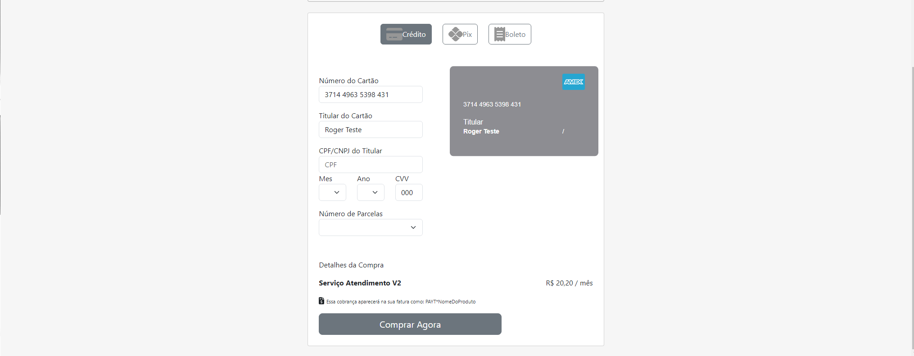

## 💻 Pré-requisitos

-------------------------------------------------

Antes de começar, verifique se você atendeu aos seguintes requisitos:
- "php": "^8.1"
- "laravel/framework": "^10.10",
- composer

Para instalar o ProjectPag, siga estas etapas:

### Windows
Entrar no inicio do repositorio
- composer install
- cp .env.example .env
- php artisan key:generate
  
### Mac/Linux
- composer install
- cp .env.example .env
- php artisan key:generate

### Rodar o Projeto apos ativar o Venv
- php artisan serve
- npm run dev
